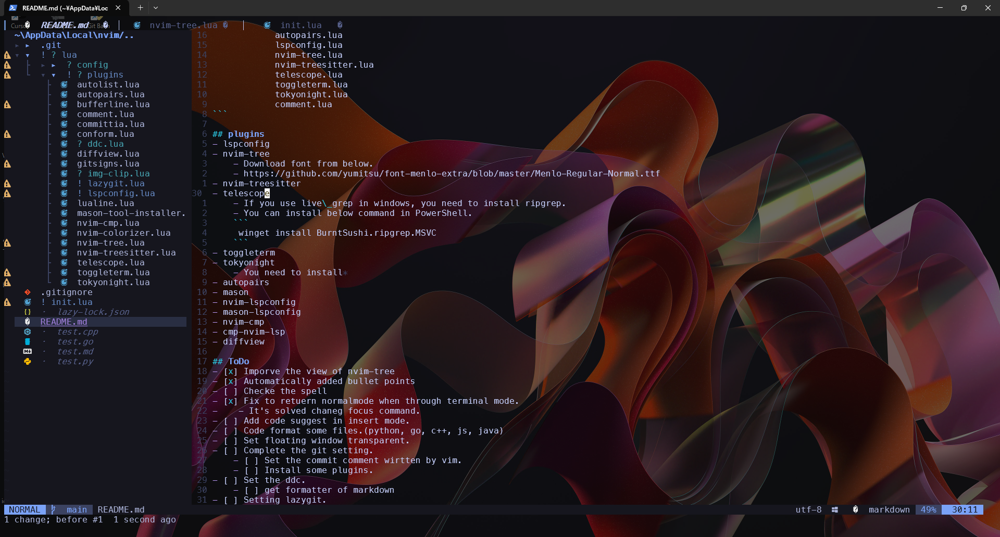

# Nvim

## Strucutre of direcotry
```
│  init.lua <- Setting except keymap, load lazy.lua and kymap.lua
│  README.md
│  
└─lua
    ├─config
    │      keymap.lua <- Setting the keymap
    │      lazy.lua <- Load plugins
    │      
    └─plugins
            autopairs.lua
            lspconfig.lua
            nvim-tree.lua
            nvim-treesitter.lua
            telescope.lua
            toggleterm.lua
            tokyonight.lua
            comment.lua
```

## plugins
- lspconfig
- nvim-tree
    - Download font from below.
    - https://github.com/yumitsu/font-menlo-extra/blob/master/Menlo-Regular-Normal.ttf
- nvim-treesitter
- telescope
    - If you use live\_grep in windows, you need to install ripgrep.
    - You can install below command in PowerShell.
    ```
     winget install BurntSushi.ripgrep.MSVC
    ```
- toggleterm
- tokyonight
    - You need to install 
- autopairs
- mason
- nvim-lspconfig
- mason-lspconfig
- nvim-cmp
- cmp-nvim-lsp
- diffview

## ToDo
- [x] Imporve the view of nvim-tree
- [x] Automatically added bullet points
- [ ] Checke the spell
- [x] Fix to retuern normalmode when through terminal mode.
-    - It's solved chaneg focus command.
    
- [ ] Add code suggest in insert mode.
- [ ] Code format some files.(python, go, c++, js, java)
- [ ] Set floating window transparent.
- [ ] Complete the git setting.
    - [ ] Set the commit comment wirtten by vim.
    - [ ] Install some plugins.
- [ ] Set the ddc.
    - [ ] get formatter of markdown
- [ ] Setting lazygit.
